# Trading Analytics Dashboard — User Guide

A complete manual for reading, using, and interpreting every metric on the dashboard.

> **Not financial advice.** This dashboard measures where price stands relative to its own statistical history. It does not predict the future. Extreme readings can always become more extreme.

---

## Table of Contents

1. [What This Dashboard Answers](#1-what-this-dashboard-answers)
2. [The Core Metric: ATR Distance](#2-the-core-metric-atr-distance)
3. [The Seven Market Regimes](#3-the-seven-market-regimes)
4. [Historical Percentiles — Why Rarity Matters](#4-historical-percentiles--why-rarity-matters)
5. [Signal-Strength Tiers](#5-signal-strength-tiers)
6. [Every Supporting Metric Explained](#6-every-supporting-metric-explained)
7. [Tab-by-Tab Walkthrough](#7-tab-by-tab-walkthrough)
8. [The BTC Cycle Signals Page](#8-the-btc-cycle-signals-page)
9. [Practical Workflows](#9-practical-workflows)
10. [Caveats & FAQ](#10-caveats--faq)

---

## 1. What This Dashboard Answers

Every trader eventually asks the same question: **"is this asset cheap or expensive right now — relative to how it normally behaves?"**

A raw price chart can't answer that. A −10% move is a catastrophe for an index fund and a Tuesday for a small-cap altcoin. This dashboard answers it by normalising every asset's stretch by **its own volatility** and then ranking the result against **its own history**.

The pipeline runs automatically every day at 09:00 UTC:

```
Yahoo Finance / Binance / GeckoTerminal
        → OHLCV data for 74 assets (daily + weekly)
        → indicators (EMA, ATR, RSI, ADX, Bollinger, Volume Profile)
        → regime classification & percentile ranking
        → this dashboard
```

**74 tracked assets:** 28 crypto, 15 NASDAQ stocks, 6 LSE income ETFs (the 49-asset *trading portfolio*), plus 25 macro assets (global indices, commodities, forex) that live on their own tab.

---

## 2. The Core Metric: ATR Distance

Everything on this dashboard hangs off one number:

```
ATR Distance = (Price − EMA21) ÷ ATR
```

- **EMA21** — the 21-period exponential moving average: the asset's short-term **trend anchor**. Note the word choice: an EMA is a *lagging average of recent prices*, not "fair value" in any fundamental sense. It follows price; it doesn't judge it.
- **ATR** — the 14-period Average True Range (Wilder's smoothing): how much the asset *typically* moves in one bar.

So ATR Distance reads as: **"how many normal days of movement is price away from its average?"**

> ⚠️ **The most important thing to understand about this metric:** ATR Distance mean-reverts to zero in **two** ways — price can rally back up to the EMA, *or* the EMA can fall down to price while price keeps bleeding. In an established downtrend it is usually the second one. A reading of −4 does **not** mean "a bounce is due"; it can resolve as "the average catches down and you're another 12% lower with the indicator reading 0." The metric tells you where price is relative to its trend — never which of the two ways the gap closes.

### Worked example

BTC trades at $64,114. Its EMA21 is $63,319 and its ATR is $1,883.

```
ATR Distance = (64,114 − 63,319) ÷ 1,883 = +0.42
```

Price is 0.42 "typical days" above its average — nothing interesting. Now imagine BTC dumps to $56,000 while EMA21 is still ~$63,300:

```
ATR Distance = (56,000 − 63,300) ÷ 1,883 = −3.9
```

Price is almost **four typical days of movement** below its anchor — panic territory, bordering on Capitulation.

### Why not just use "% below the moving average"?

Because volatility differs wildly per asset. A quiet index being 5% under its EMA is a bigger statistical event than a meme coin being 15% under its EMA. Dividing by ATR puts every asset — BTC, the S&P 500, a $50M altcoin, wheat futures — on **the same scale**, which is what makes cross-asset ranking meaningful.

> Both EMA and ATR are SMA-seeded and use Wilder's smoothing, matching TradingView's `ta.ema()` / `ta.atr()` exactly, so you can verify any value on your own charts. If ATR is 0 (dead market), ATR Distance is undefined and shown as N/A.

---

## 3. The Seven Market Regimes

ATR Distance maps directly onto seven regimes. These drive the coloured badge on every card, the card's border colour, and the zone bands on every gauge and chart.

| Regime | ATR Distance | Colour | What it means | Typical interpretation |
|---|---|---|---|---|
| **Ragequit** | < −7 | 🟣 deep purple | Historically extreme panic | Forced selling / liquidation cascades. Rare — but see the asymmetry note below: it prints far more often than its upside mirror. |
| **Capitulation** | −7 to −4 | 🟥 dark red | Panic | The market is disorderly. Some durable bottoms have started here — and so has the first half of many larger declines. The reading itself doesn't distinguish them. |
| **Accumulation** | −4 to −2 | 🟢 green | Oversold | Statistically stretched to the downside. A *watch* zone — in an established downtrend, this is also exactly what a falling knife looks like on the way through. |
| **Trend** | −2 to +2 | 🔵 blue | Balanced | Price is within normal noise of its anchor. No positional edge from stretch alone — most assets are here most of the time. |
| **Distribution** | +2 to +4 | 🟠 orange | Extended | Statistically stretched to the upside. Where profit-taking tends to cluster. |
| **Mania** | +4 to +7 | 🔴 red | Euphoric | Powerful momentum, but the reading is rare and mean-reversion risk is elevated. |
| **Blow-off** | > +7 | 🩷 hot pink | Historically extreme euphoria | Parabolic. Momentum can extend it further; risk/reward for *new* entries at this reading is poor. |

> ⚠️ **Oversold is not a buy signal. Read this before the Opportunity panel.**
> The dashboard's vocabulary ("Opportunity", "Accumulation") leans mean-reversion, and buying weakness inside a downtrend is the single most expensive habit in retail trading. An asset at −4 with **ADX > 25 and price below a falling EMA50 and 200DMA is a trend in progress, not a discount** — stretch can persist and deepen for weeks. Every oversold reading must pass a trend check (ADX + the Drilldown moving-average structure, [Section 6](#adx-average-directional-index--trend-strength)) before it deserves the word "opportunity". The workflows in [Section 9](#9-practical-workflows) build this check in — don't skip it.

Three more things to keep in mind:

1. **The thresholds are symmetric; markets are not.** Downside moves are faster and fatter-tailed than upside moves, so **Ragequit prints considerably more often than Blow-off** — they are mirror *thresholds*, not equivalent-probability events. Treat a Blow-off as the rarer, and a Ragequit as the more "ordinary", of the two extremes.
2. **A regime is a location, not a signal by itself.** Accumulation means *statistically cheap relative to trend*, not *bounce due*. That's why the dashboard layers percentiles, weekly confirmation, trend strength, and volume context on top.
3. **Nothing in this guide is backtested.** Where the text says a reading is "associated with" bottoms or tops, that is a qualitative observation, not a measured base rate. The dashboard tells you *where you are in the historical distribution* — it makes no claim about forward returns. Treat every historical association here as a hypothesis to check, not an edge to bank.

---

## 4. Historical Percentiles — Why Rarity Matters

Next to the ATR Distance on each card you'll see a badge like **P55%** or **P4%**. This is the **percentile rank of today's ATR Distance within that asset's entire recorded history**.

- **P4%** → the asset has closed this oversold (or more) on only 4% of all its recorded bars. Genuinely rare *for this asset*.
- **P55%** → completely ordinary; happens more than half the time.

This is the second normalisation layer. ATR Distance already normalises by volatility; the percentile normalises by **each asset's own personality**. Some assets (leveraged miners, small caps) routinely swing to ±3 — a −3 reading on those is unremarkable. A staid index at −3 might be a P2% event.

**Rule of thumb:** the absolute ATR Distance tells you *how stretched*, the percentile tells you *how unusual*. The strongest setups are stretched **and** unusual.

> ⚠️ **Sample size makes or breaks a percentile.** Badges appear from **30 bars of history**, but 30 daily bars is six weeks — a "P4%" computed on 30 samples is one bar out of thirty, i.e. statistical noise wearing the same badge as a P4% computed on 4,000 bars of BTC history. The dashboard renders both identically, so *you* must check: open the Extremes tab and look at the **sample size** in the stats grid. Under ~200 bars, treat any percentile as indicative only — and note that the newest, thinnest-history listings are precisely where percentiles look most dramatic and mean the least.

---

## 5. Signal-Strength Tiers

The Opportunity/Risk panels and the Rankings tab label each asset with a severity tier. The label takes the **more severe** of two independent signals — percentile rarity or absolute stretch — so a strong reading on either dimension is enough:

**Oversold direction** (negative ATR Distance):

| Tier | Percentile condition | ATR Distance condition |
|---|---|---|
| **Ragequit** | — | dist < −7 |
| **Extreme Oversold** | P ≤ 5% | dist < −4 |
| **Deep Oversold** | P ≤ 15% | dist < −3 |
| **Oversold** | P ≤ 30% | dist < −2 |
| **Mild Dip** | fallback — no strong signal | |

**Extended direction** (positive ATR Distance):

| Tier | Percentile condition | ATR Distance condition |
|---|---|---|
| **Blow-off** | — | dist > +7 |
| **Extreme Extended** | P ≥ 95% | dist > +4 |
| **High Extended** | P ≥ 85% | dist > +3 |
| **Extended** | P ≥ 70% | dist > +2 |
| **Mild Extension** | fallback — no strong signal | |

Two worked examples:

- **YMST** at ATR Distance −3.35 (P16%): the stretch qualifies for *Deep Oversold* (< −3), the percentile only for *Oversold* (≤ 30%). More severe wins → **Deep Oversold**.
- **BTC** at −2.39 (P4%): the stretch only qualifies for *Oversold*, but P4% is *Extreme* rarity → **Extreme Oversold**. BTC rarely gets even this far below its EMA — the percentile catches what the raw number understates.

Percentile tiers require ≥30 bars of history; thin-history assets fall back to the ATR Distance conditions alone.

---

## 6. Every Supporting Metric Explained

Each subsection: what it is → how it's computed → how to read it.

### RSI (Relative Strength Index)

14-period, Wilder's smoothing (TradingView-identical). Momentum oscillator from 0–100.

- **< 30** — oversold momentum. **> 70** — overbought momentum.
- Best read *together with* ATR Distance: deep ATR Distance + RSI < 30 = stretch confirmed by momentum washout. Deep ATR Distance + RSI recovering up through 30 = possible turn.

### RSI Z-Score

RSI normalised over its own trailing 20 periods: `(RSI − mean) ÷ stdev`.

- **|Z| > 1.5** means RSI itself is unusually high/low *for this asset's recent behaviour* — the same "personality adjustment" idea as the percentile badge, applied to momentum.
- Useful because a "neutral" RSI of 45 can be a 2-sigma low for an asset that has been grinding at RSI 60 for months.

### ADX (Average Directional Index) — trend strength

14-period, Wilder's smoothing. Measures **how strongly price is trending, regardless of direction** (0–100).

| Badge | ADX | Meaning |
|---|---|---|
| 🟢 Trending | > 25 | A real directional move is in progress |
| 🟡 Neutral | 20–25 | Indeterminate |
| ⚪ Ranging | < 20 | Sideways chop; mean-reversion setups more reliable |

Combine with ATR Distance: **oversold + high ADX** = strong downtrend in progress (falling knife — stretch may persist); **oversold + low ADX** = drift lower without conviction (mean-reversion more likely to stick).

### Bollinger Band %B and Bandwidth

20-period bands at 2 standard deviations. `%B = (Price − LowerBand) ÷ (UpperBand − LowerBand)`.

- **%B < 0** — price has broken *below* the lower band (statistical oversold breakout, badge green)
- **0–0.2** — near the lower band (light green) · **0.2–0.8** — mid-band, neutral (grey) · **0.8–1.0** — near upper band (amber)
- **%B > 1** — broken *above* the upper band (overbought breakout, red)

**Bandwidth** = band width as % of the midline. A bandwidth at multi-month lows is a **squeeze** — volatility compression that historically precedes large moves (direction unknown; the squeeze tells you *energy is loading*, not which way it fires).

### EMA50 Distance (E50 badge)

`(Price − EMA50) ÷ ATR` — same construction as ATR Distance but against the **50-period** EMA, giving medium-term context. Same seven-tier colour scale.

The powerful pattern: **ATR Distance ≈ 0 but E50 still deeply negative** → price has recovered short-term but remains far below its medium-term anchor. Rallies inside damaged trends look exactly like this. Requires ≥50 bars.

### 200DMA Proximity (200D badge)

`(Price − 200-day SMA) ÷ 200-day SMA × 100` — the classic long-term bull/bear line, as a percentage.

| Badge colour | Range | Read |
|---|---|---|
| 🟢 green | < −20% | Deep below — historically a long-term value zone |
| 🟩 light green | −20% to 0% | Below the line |
| ⚪ grey | 0% to +20% | Near / normal |
| 🟠 amber | +20% to +50% | Extended above |
| 🔴 red | ≥ +50% | Historically extreme extension |

Requires ≥200 daily bars. Also drawn on the Drilldown price chart (purple dashed line) together with EMA50 (orange/blue dashed).

### Volume Profile (VP)

Answers: **at what prices did the real business get done?** The last 90 daily bars (52 weekly) are sliced into 24 price buckets and each bar's volume is distributed across the buckets it spans.

- **POC (Point of Control)** — the single highest-volume price bucket. The market's strongest "memory" *zone* — often treated as a magnet and as support/resistance.
- **Value Area (VAH → VAL)** — the price band containing 70% of all volume. *Inside* it = business as usual.
- **Position badge:** `Above VAH` (price accepted above value — bullish but stretched) · `In VA` (normal) · `At POC` (at the magnet — decision point) · `Below VAL` (rejected below value — either capitulation or the start of a markdown).

Pattern worth knowing: an oversold asset sitting **just below VAL** with the POC well above it has a natural "return to value" reference (the POC) *if* it reclaims the value area.

**Precision caveat (applies everywhere VP is mentioned):** this VP is built from daily bars with each bar's volume spread *uniformly* across its high–low range — a deliberately crude approximation of where volume actually traded. The POC and VA edges are **zones a bucket wide, not exact prices**, and can differ materially from a tick-based profile (TradingView's VPVR). Use them as areas of interest, never as precise trigger levels.

### ATR Trend (↑ / ↓ / ─)

Slope of the last 10 ATR values: **expanding** (volatility rising), **compressing** (falling), or **flat**.

- Expanding volatility during a decline = panic still accelerating; expanding during an advance = mania fuel.
- **Compressing after an extreme** is what stabilisation looks like — a pattern often *associated with* basing (price flatlining while ATR bleeds off). As with everything here, that's a qualitative observation, not a measured base rate: compression also happens mid-decline before the next leg.

### Multi-Timeframe Alignment (↑↑ / ↓↓ / ↕)

Compares the **daily** regime with the **weekly** regime:

- **↑↑ aligned-bullish** — both timeframes oversold: the stretch is structural, not intraweek noise. Strongest mean-reversion context.
- **↓↓ aligned-bearish** — both extended: risk is confirmed on the higher timeframe.
- **↕ diverging** — the timeframes disagree; the daily reading may just be noise inside a different weekly picture.

### RS/BTC (crypto only)

30-day return of the asset divided by the 30-day return of BTC. **> 1× (green ↑)** = outperforming BTC; **< 1× (red ↓)** = underperforming. An oversold alt that is *still* outperforming BTC is showing relative strength through weakness — a pattern accumulation-minded traders watch for, though it is a positioning observation, not a validated predictor.

### Funding Rate & Open Interest (crypto only)

From perpetual futures markets (rate shown as % per 8h period):

- **Strongly positive funding** — longs pay shorts; crowded long positioning; long-squeeze risk.
- **Negative funding** — shorts pay longs; crowded short positioning. On an oversold asset this creates short-squeeze *potential* — fuel, not ignition. Crowded shorts can stay crowded (and right) for a long time.
- **Open Interest** — total outstanding futures exposure in USD. Rising OI + extreme funding = the crowd is leveraged and vulnerable. Null for coins without a Binance perpetual.

### Composite Signal Score (−10 … +10)

A single number aggregating four signals, weighted:

```
Score = ATR-percentile signal ×4  +  RSI Z-Score ×3  +  VP position ×2  +  TF alignment ×1
```

**Positive = oversold, negative = extended.** Badge colours: ≥ +6 strong green · ≥ +2 green · −2…+2 grey · ≤ −2 amber · ≤ −6 red.

**Be clear about what this is:** the weights are **heuristic — chosen by judgment, not fitted, optimised, or validated out-of-sample** — and the inputs aren't even commensurable units (a percentile, a z-score, and two categorical states summed together). The decimals convey false precision; a +6.2 is not meaningfully "better" than a +5.8. Use it for exactly one thing: **sorting the board** so the most stretched composite readings surface first (**Score ↓**). It is a screening order, not a measure of setup quality, and never a reason to act without opening the Drilldown.

### Chg%

Bar-over-bar price change. On the daily view: yesterday's close → latest close.

### Market Context Bar (top of Portfolio)

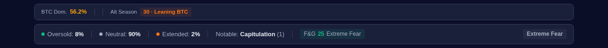

- **BTC Dominance** — BTC's share of total crypto market cap. Rising dominance suppresses altcoins; falling dominance with strong alts = rotation.
- **Altseason Score (0–100)** — % of the tracked cryptos (excluding BTC) outperforming BTC over 90 days. > 75 = Altcoin Season, < 25 = Bitcoin Season.
- **Fear & Greed Index (0–100)** — crowd sentiment from alternative.me. Usually read as a contrarian gauge (Extreme Fear near lows, Extreme Greed near highs) — but treat that with care: **Extreme Fear can persist for months in a bear market**, and the index describes *current sentiment*, not forward returns. Fear + capitulation readings together (as in the screenshot) tell you the crowd is maximally pessimistic — they do not tell you the decline is finished.

---

## 7. Tab-by-Tab Walkthrough

### 7.1 Portfolio — the daily home base

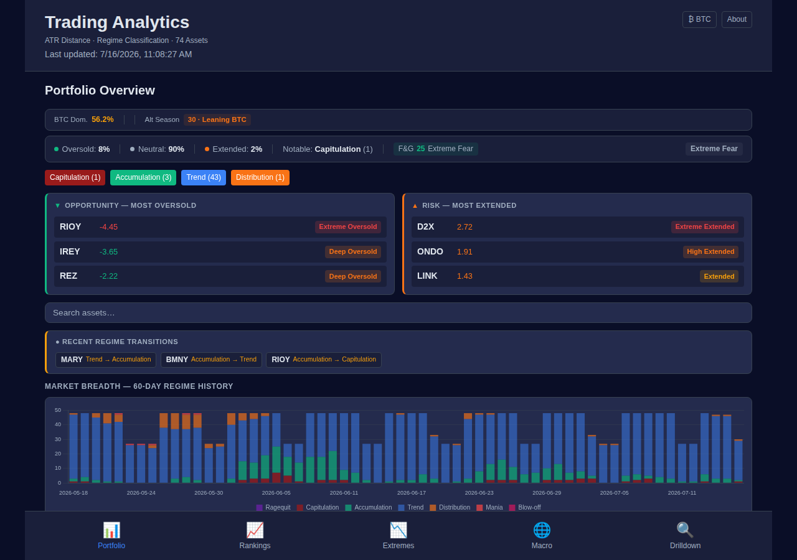

Top to bottom:

1. **Market context bar** — BTC.D, Altseason, F&G (see above).
2. **Health bar** — the portfolio's regime distribution in one line: *Oversold 8% · Neutral 90% · Extended 2%*, the most notable regime currently printing, and an overall sentiment label.
3. **Regime strip** — clickable count chips (`Capitulation (1)`, `Trend (43)`, …). Click one to filter the cards to that regime.
4. **Opportunity / Risk panels** — the three most oversold and three most extended assets, each with its severity tier:

   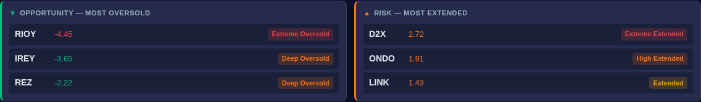

5. **Search box** — live-filters cards by symbol.
6. **Recent Regime Transitions** — yellow chips for every asset whose regime changed on the last bar (`RIOY: Accumulation → Capitulation`). Transitions *into* outer regimes are the events worth investigating same-day.
7. **Market Breadth (60-day)** — stacked bars of the daily regime counts:

   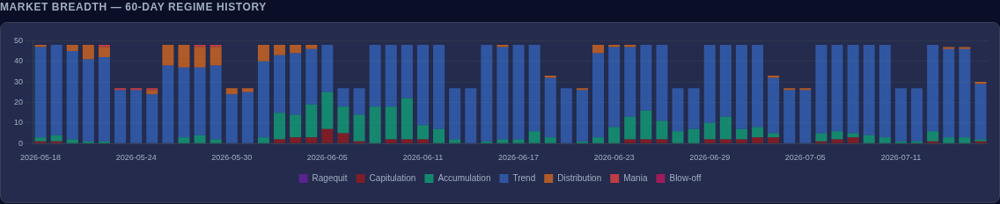

   Read it as weather history: mostly-blue columns = calm; green floods from below = broad oversold episodes (the June cluster above); orange/red tops = broad extension. Breadth extremes mark *market-wide* opportunity or risk better than any single asset can.
8. **Filter bar** — Timeframe (Daily/Weekly), Category (All/Crypto/NASDAQ/LSE), Sort (incl. **Score ↓** and **Market Cap ↓**), and the **Detail** toggle.
9. **Asset cards** — see below.

#### Anatomy of an asset card (Expert mode)

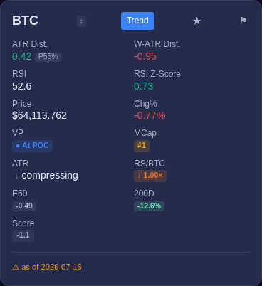

| Row | What you're seeing |
|---|---|
| Header | Symbol · regime badge (**Trend**) · ★ watchlist star · ⚑ alert flag |
| ATR Dist. | **0.42** coloured by severity, with the percentile badge **P55%** |
| W-ATR Dist. | The *weekly* ATR Distance (−0.95) — instant higher-timeframe check |
| RSI / RSI Z-Score | Momentum and its personality-adjusted Z |
| Price / Chg% | Latest price and bar-over-bar change |
| VP / MCap | Volume-profile position badge · market-cap rank |
| ATR / RS/BTC | ATR trend (compressing) · relative strength vs BTC (1.00×) |
| E50 / 200D | EMA50 distance (−0.49) · 200DMA proximity (−12.6%) |
| Score | Composite signal score (−1.1) |
| Footer | Data-freshness stamp (amber ⚠ when the asset lags the global dataset) |

A 14-bar ATR Distance **sparkline** at the bottom shows the recent trajectory at a glance — direction matters as much as level.

#### Novice mode

The Detail toggle (filter bar) switches every card to the essentials — regime, ATR Distance + percentile, RSI, price, Chg%:

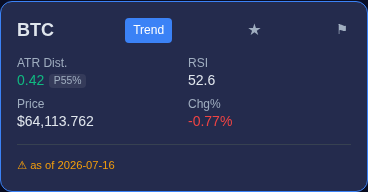

Start in Novice while you internalise ATR Distance and regimes; switch to Expert when the extra badges answer questions instead of raising them. The choice persists across visits.

#### Watchlist and alerts

- **★** pins up to 10 assets to the top of the card list (stored in your browser).
- **⚑** opens the alert dialog:

  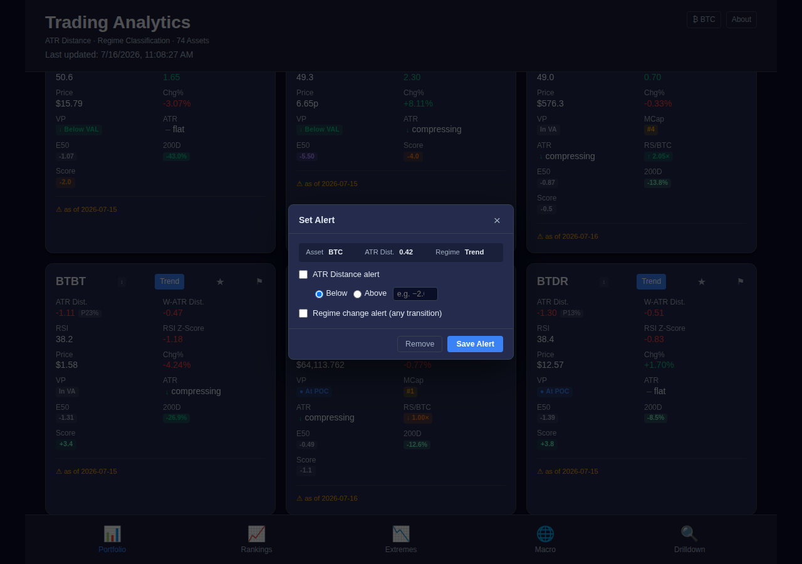

  Two alert types per asset: **ATR Distance threshold** (fire when the value crosses below/above your level) and **regime change** (fire on any transition). Alerts are crossing-based — they fire once when breached (as a browser notification, or an in-page toast if notifications are blocked), not on every page load.

### 7.2 Rankings — the full ranked board

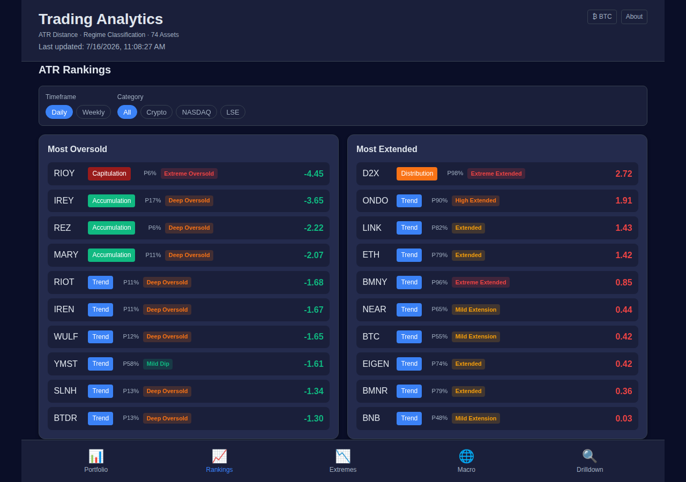

The ten most oversold and ten most extended assets, each with regime badge, percentile, severity tier, and ATR Distance. Two filter groups:

- **Timeframe** — Daily or **Weekly**. Weekly rankings surface structural stretch that daily noise hides; an asset near the top of both lists is stretched at every resolution.
- **Category** — All / Crypto / NASDAQ / LSE, for like-for-like comparisons inside one asset class.

Click any row to jump straight to its Drilldown. Macro assets are excluded here.

### 7.3 Extremes — historical context for one asset

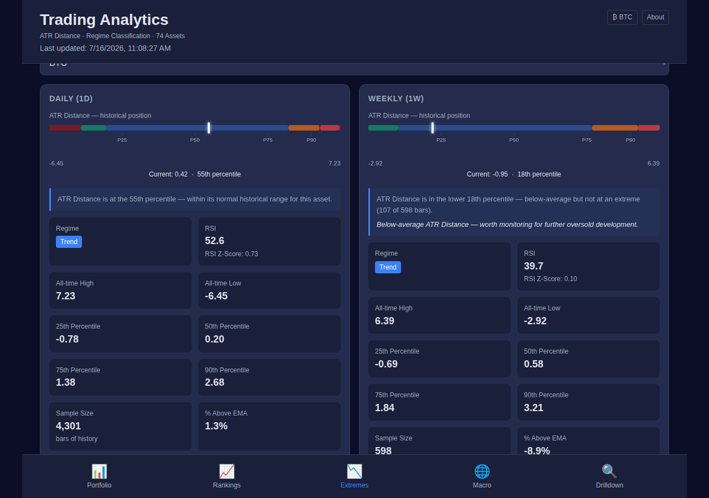

Pick any portfolio asset and see, for daily and weekly side by side:

- **The percentile gauge** — the white marker is today's ATR Distance placed inside the asset's full historical distribution. The coloured zones are the seven regimes, and the **width of each zone is proportional to how often the asset has actually been there** (the axis is percentile-spaced, not linear). A huge blue Trend zone literally means "this asset almost never reaches its extremes" — so when the marker leaves it, take notice.
- **Interpretation sentence** — plain-language reading ("lower 18th percentile — below-average but not at an extreme (107 of 598 bars)").
- **Stats grid** — all-time high/low ATR Distance, P25/P50/P75/P90 breakpoints, sample size, % above EMA.

Use this tab to calibrate: before treating any reading as extreme, look at where it truly sits in the asset's own distribution.

### 7.4 Macro — global context

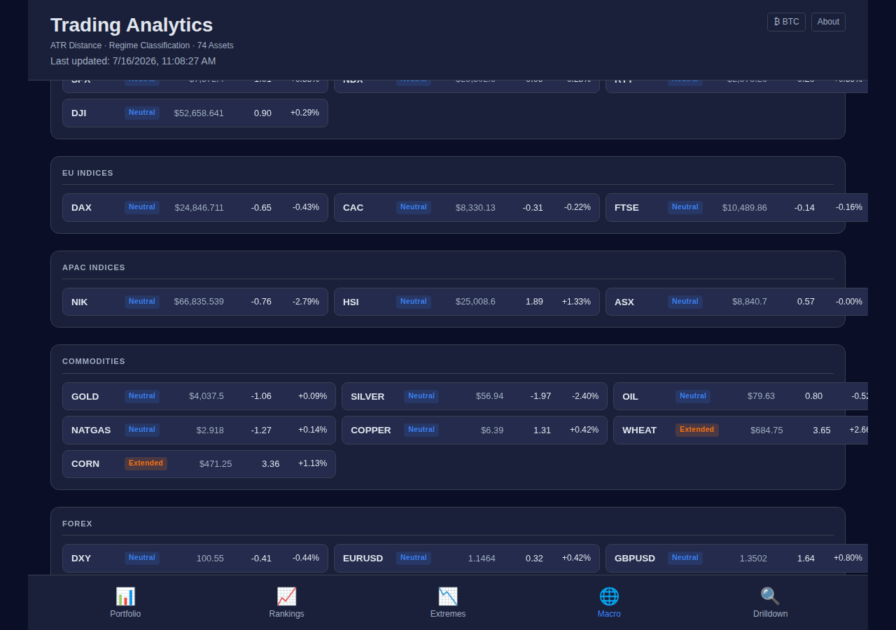

25 assets in five groups: US / EU / APAC indices, commodities, forex + DXY. Same pipeline and ATR Distance math, but neutral zone labels (Neutral / Oversold / Extended / Extreme Crash / Blow-off) instead of the crypto-flavoured regime names. Macro assets never appear in Portfolio, Rankings, or the Opportunity/Risk panels.

Why it matters: risk assets are correlated, so a crypto or equity signal printed while indices are mid-capitulation is usually part of a market-wide tide rather than an asset-specific story, and a DXY (dollar) extension is a headwind for everything priced in dollars. But hold the correlation loosely — **it is weakest exactly when it matters most**: in acute crises everything can bottom together in a single liquidation event (March 2020), and crypto has led equities at turns as often as it has followed. Use the tab to ask "is this move idiosyncratic or systemic?", not to sequence entries. Click any card for a full Drilldown.

### 7.5 Drilldown — the full picture for one asset

Everything the dashboard knows about a single asset+timeframe. Top of the page:

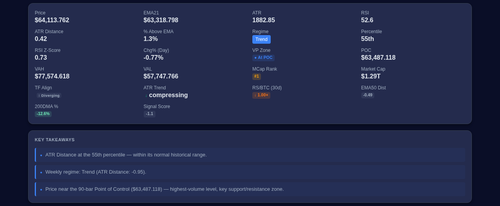

- **Summary grid** — every metric from this guide in numeric form (price, EMA21, ATR, RSI, ATR Distance + percentile, VP levels POC/VAH/VAL, TF alignment, ATR trend, RS/BTC, funding/OI for crypto, ADX, BB %B and width, EMA50 dist, 200DMA %, Score).
- **Key Takeaways** — up to five auto-generated plain-language insights (ATR percentile, RSI status, weekly regime, ATR trend, VP position). A fast sanity-check that you read the numbers the same way the system does.

Then the charts (90 bars):

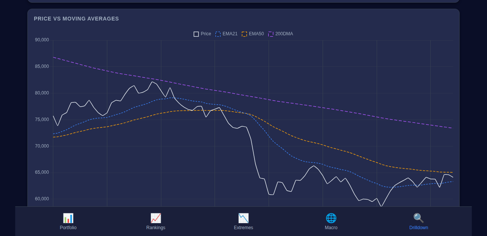

- **Price vs Moving Averages** — price with EMA21 (blue), EMA50 (orange), 200DMA (purple). One glance shows the trend structure: in the example, price below all three falling averages = confirmed downtrend; the takeaway "still below a declining 200DMA" would be doing the same work.
- **ATR Distance chart** — the metric itself with the seven regime zones shaded in the background; you can see every historical visit to each zone.
- **RSI chart** with 30/70 bands, and the **Weekly ATR Distance** chart for the higher timeframe.
- **90-Day Volume Profile**:

  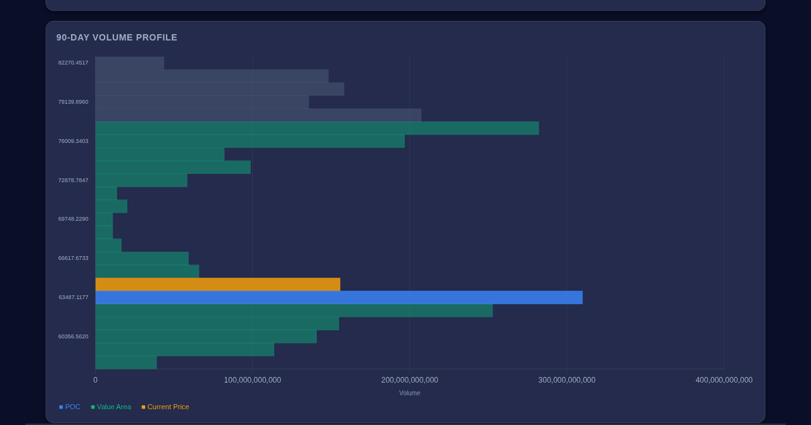

  Horizontal volume-at-price bars. Blue = POC, green = Value Area, orange = current price. In this example price sits just above the POC (~$63.5k) — the highest-volume shelf of the last 90 days is directly below, a *potential* support zone. (Remember the precision caveat from Section 6: these are bucket-wide zones from daily bars, not exact levels.)

---

## 8. The BTC Cycle Signals Page

Reached via the **₿ BTC** button in the header — a standalone confluence board for Bitcoin's *cycle* position (months, not days):

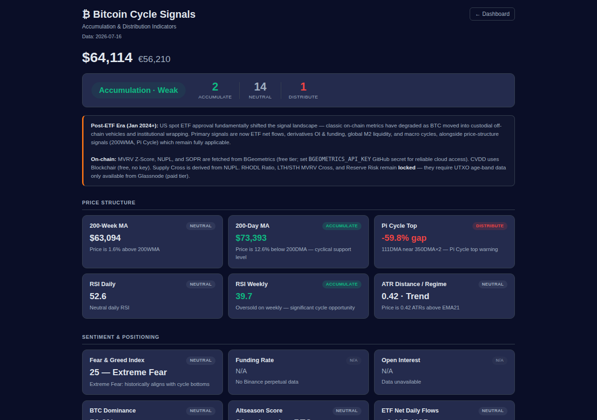

- **Confluence banner** — every active signal votes *Accumulate / Neutral / Distribute*; the banner shows the tally and an overall phase ("Accumulation · Weak" = accumulate votes lead, without broad agreement).
- **Price Structure** — 200-Week MA (the classic cycle-floor), 200-Day MA, Pi Cycle Top, daily & weekly RSI, ATR regime.
- **Sentiment & Positioning** — Fear & Greed, funding, OI, BTC dominance, Altseason, ETF net flows (needs `SOSOVALUE_API_KEY`).
- **Mining & Liquidity** — Hash Ribbons (miner capitulation/recovery), Puell Multiple (miner revenue vs its yearly average), stablecoin supply trend, Global M2 with a 12-week lag (needs `FRED_API_KEY`).
- **On-Chain** — MVRV Z-Score, NUPL, SOPR, CVDD (all free-source), plus **Supply Cross**: when NUPL < 0, the majority of BTC supply is held at a loss — historically every major cycle bottom occurred within ~3 months of that cross. (Counted as context, not in the confluence tally, to avoid double-counting NUPL.) RHODL, LTH/STH MVRV Cross and Reserve Risk stay locked (they require paid Glassnode data).

How to use it: **don't trade off any single card.** The page is built on the idea that cycle turns show up as *converging* independent evidence — price structure + sentiment + mining + on-chain all leaning the same way. Also read the era note at the top: since the 2024 spot ETFs, coins held in custodial wrappers weaken classic on-chain metrics, so ETF flows / derivatives / liquidity signals carry more weight than they used to.

---

## 9. Practical Workflows

**A bias disclosure before the workflows.** This dashboard — and therefore this section — leans toward one style: *mean-reversion from oversold extremes*. That is a choice, not the only valid way to trade, and its failure mode (buying weakness inside downtrends) is well documented. The extended side of the board is presented here for **risk reduction on what you already hold**, not as a shorting manual; and momentum/breakout entries are a different toolkit this dashboard only partially serves (ADX and the MA structure help, but there is no breakout workflow). Know which game you're playing before using any of the recipes below.

**And an execution reality that applies to all of them:** the data is end-of-day, computed once daily at 09:00 UTC. **You cannot trade the print you see.** By the time a Capitulation reading is on your screen, the next session may have gapped through your level — in both directions. Every workflow below produces *candidates to plan around*, with entries and invalidations defined by you at live prices — never "the dashboard said −4, so I bought the open."

### The 60-second morning scan

1. **Market context bar** — F&G, BTC.D, Altseason: what's the weather?
2. **Health bar + breadth chart** — is stretch broad or isolated? A green flood on breadth is a different market from one lonely oversold ticker.
3. **Transition chips** — anything newly entering Capitulation/Ragequit (or Mania/Blow-off) is today's homework.
4. **Opportunity / Risk panels** — the three most stretched names each way, pre-labelled by severity.
5. Sort cards by **Score ↓** for the composite view of the whole board.

### Vetting an oversold candidate

Found something interesting (say, *Extreme Oversold* in the Opportunity panel)? Walk it through five checks before acting:

1. **Rarity** — Extremes tab: is this genuinely rare for this asset (P ≤ 10%), or does it live here? The percentile-spaced gauge makes this obvious.
2. **Higher timeframe** — W-ATR on the card / weekly gauge: ↑↑ aligned-bullish means the stretch is structural; ↕ diverging means daily noise.
3. **Trend state** — ADX + the Drilldown price chart: ADX > 25 with price under all three falling MAs = catching a falling knife; ADX < 20 with ATR **compressing** = a base may be forming.
4. **Volume context** — VP: below VAL with POC overhead gives you a defined "return to value" target; At POC means the battle is being fought at the key level right now.
5. **Positioning (crypto)** — negative funding on an oversold asset = crowded shorts = squeeze *fuel* (not ignition); strongly positive funding = the bounce is already crowded.

Then set a **⚑ alert** at your level instead of staring at charts — and before any entry, do the risk work below.

### Risk management is not optional

Nothing above is a trade plan until it has all four of these. The dashboard provides none of them — they are yours:

1. **Invalidation before entry.** Write down what would prove the thesis wrong *before* you enter — a price level, a regime (e.g. "daily closes into Ragequit"), a structure break. "Oversold got more oversold" is not a plan; it's how Accumulation-zone buyers ride a position into Capitulation while feeling smarter at every tick down.
2. **A hard stop, placed where the invalidation is** — not where the loss feels tolerable. If the stop distance is wider than you can afford, the position is too big, not the stop too far.
3. **Position sizing from the stop.** Decide the maximum loss per trade first (a fixed fraction of capital), then `size = max loss ÷ stop distance`. ATR is right there on every card — a stop tighter than ~1 ATR on a daily-timeframe signal is noise waiting to take you out.
4. **Portfolio-level exposure.** Ten "independent" oversold longs in a broad risk-off episode are one trade wearing ten tickers — the breadth chart and Macro tab exist precisely to show you when the whole board is a single correlated bet.

An extreme reading is a *condition*. Entry, invalidation, size, and exit are *decisions* — and they're the part that determines whether you survive being wrong, which you regularly will be.


### Risk-checking what you hold

1. ★ star your holdings — they pin to the top.
2. Watch for **Distribution/Mania** badges, Score turning negative, and ↓↓ aligned-bearish.
3. On the BTC page, a *Distribution* confluence phase is the macro tide against every crypto position.
4. Set regime-change alerts on each holding — the dashboard then taps you on the shoulder.

---

## 10. Caveats & FAQ

**Why does an asset show "as of <older date>" in amber?**
Its last data point lags the newest data in the set (weekends for stocks, delistings, API hiccups). Assets more than 60 days stale are dropped from the dashboard entirely.

**Why are some badges missing on a card?**
Every metric degrades gracefully to hidden when its inputs are unavailable: percentile needs ≥30 bars, EMA50 ≥50, 200DMA ≥200, ADX ≥27, Bollinger ≥20; VP needs ≥20 bars of non-zero volume; funding/OI need a Binance USDT-M perpetual (D2X, SCP and some new listings have none); RS/BTC is crypto-only.

**How fresh is the data?**
The pipeline runs daily at 09:00 UTC. This is an end-of-day tool by design — it measures statistical stretch, not intraday flow. The practical consequence bears repeating: any reading you see is at least hours old, and the market may have gapped through it. Signals here are for planning, not execution.

**Are the indicators identical to TradingView?**
Yes — EMA, ATR, RSI and ADX are SMA-seeded with Wilder's smoothing, matching `ta.ema()`, `ta.atr()`, `ta.rsi()`. Any value here can be reproduced on a TradingView chart.

**Why does the weekly view disagree with the daily?**
Because they measure different structures — that disagreement *is* the alignment signal (↕). When both agree (↑↑ / ↓↓), the reading carries far more weight.

**Volume Profile looks different from TradingView's VPVR.**
Daily bars distribute volume uniformly across each bar's high–low range — coarser than tick-level VPVR. Levels are approximate zones, not exact prices. LSE ETF volume is share count, so their VP is valid within the asset but not comparable across assets.

**I'm red-green colorblind — is this dashboard usable?**
Honestly: the visual language leans heavily on red/green (extended/oversold), which is the worst pairing for deuteranopia. The information is never *only* in the colour, though — every badge carries text (regime name, tier label, percentile), the ATR Distance sign tells you the direction, and the outer extremes use purple/pink rather than deeper red/green. If you rely on the numbers and badge text rather than the colour wash, nothing is hidden from you. A colorblind-friendly palette is a fair feature request.

**Can a Blow-off / Ragequit reading keep going?**
Absolutely. Beyond ±7 you are in the tail of the distribution, but tails have tails. These regimes flag *historically extreme risk/reward*, not a reversal timestamp — which is why the workflows lean on confirmation (weekly alignment, ATR compression, funding) rather than the level alone.

---

*Generated for the [Trading Analytics dashboard](../README.md). See [CLAUDE.md](../CLAUDE.md) for the technical/architecture reference, or the in-app About page for a condensed overview.*
